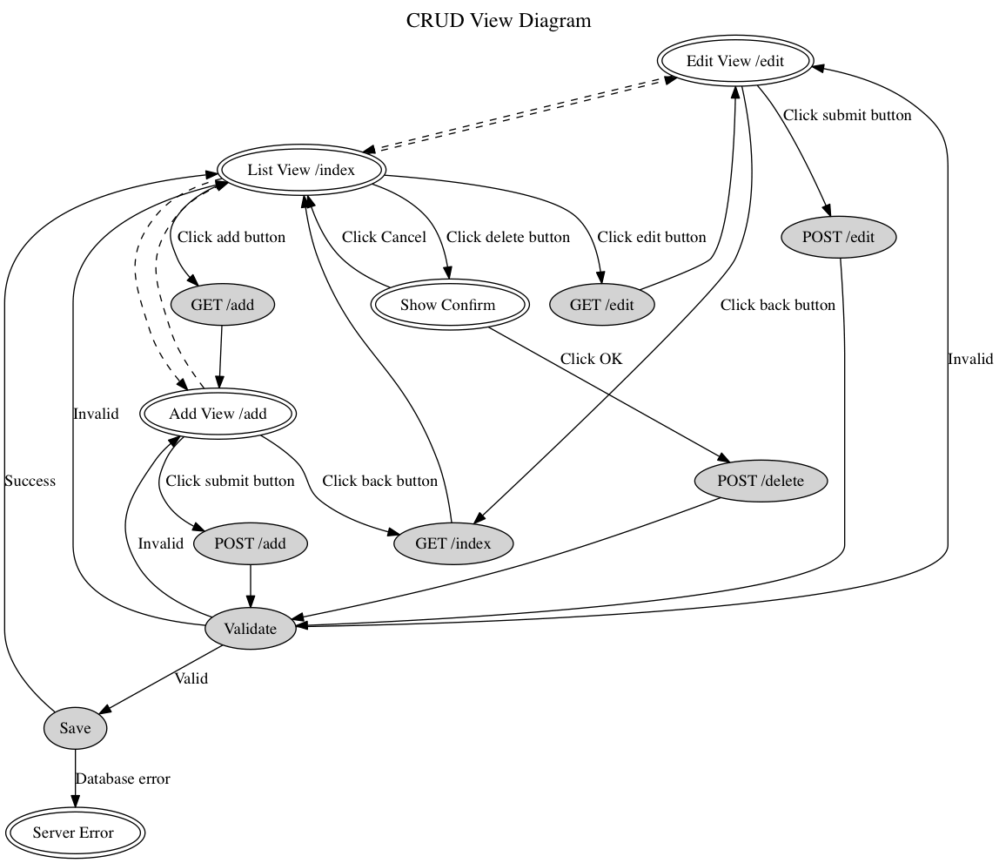

Pyagram
=======

Python Finite State Machine Diagram Generator  

This is a command line tool, which generates finite state machine diagram for web and mobile application development from a source file through graphviz.  

The finite state machine diagram is a kind of diagram, which describes screen transitions and flows of the processes.  

The source file is written in a specific format, which enables us to write a code easier than using only graphviz, since Pyagram generates graphviz code as an intermediate file.  

Since graphviz provides 3 kinds of image formats, such as gif, png and svg, Pyagram provides these kinds of file format as well.  

This is an example of the diagrams.  

As you can see, there are several kinds of objects in the diagram.  

* Title of a diagram
* Double circle represents a view.
* Gray background circle represents a server side process including action.
* Dashed arrow represents a screen transition between views.
* Straight arrow represents flow of the process, such as accepting a request, validation, database access and so on.
* Straight arrow is able to have an label, which describes an action and a result of the process, such as clicking a button, success, error and so on.

How to write source file
------------------------

Firstly you can define a title of the diagram with @ sign.  
    

    @[title]
    CRUD View Diagram
    

Next you can define views with # sign and its screen transitions with --> sign.  

Now we have 3 views, such as List View, Add View and Server Error View.  

List View and Add View are connected one another.  

You can define its own path below the view name as well.  

I highly recommend you to define those views first, since that would help you when you are trying to define server processes as a guide.  
    

    #[List View]
    /index
    
    --> Add View
    
    #[Add View]
    /add
    
    --> List View
    
    --> Add View

    #[Server Error]

Then you can define server processes with ==> sign connecting source process and destination process.  

As you can see, process is able to have multiple flows. Each flow has its own destination.  

You can add results of the processes, such as Valid, Invalid, Success, Database Error and so on. It will be used as labels placed beside the straight arrows.  

    $[GET /index]
    ==> List View
    
    $[GET /add]
    ==> Add View
    
    $[POST /add]
    ==> Validate
    
    $[Validate]
    Valid
    ==> Save
    
    Invalid
    ==> Add View
    
    $[Save]
    ==> Add View
    
    $[Save]
    Success
    ==> List View
    
    Database error
    ==> Server Error
    
    
Now that you can define the flows between the views and the processes with ==> sign.  

    #[List View]
    /index
    
    --> Add View
    
    Click add button
    ==> GET /add
    

    #[Add View]
    /add
    
    --> List View
    
    --> Add View

    Click back button
    ==> GET /index
    
    Click submit button
    ==> POST /add

How to install
--------------

pip3 command installs depending library, such as pyparsing automatically.  

After the installation, executable pyagram command will be placed in a bin directory, such as /usr/local/bin/pyagram.  

    pip3 install pyagram

How to execute
--------------

pyagram command accepts 2 kinds of options.  

t option represents image type, which accepts gif, png and svg.  

o option represents output path, which accepts path.  

i option represents source file, which accepts text file.  

Output file is placed in the same place as the source file.  

    pyagram -t {image type} -o output path{} -i {source file}

